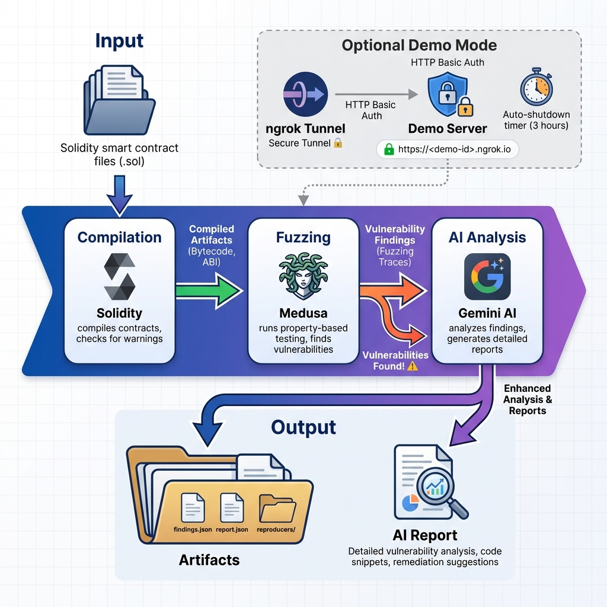

# 🛡️# Smart Contract Security Auditor

AI-powered vulnerability detection for Solidity smart contracts using symbolic fuzzing and machine learning.

## Architecture



The auditor follows a three-stage pipeline:
1. **Compilation** - Validates Solidity code and checks for compiler warnings
2. **Fuzzing** - Uses Medusa to discover vulnerabilities through property-based testing  
3. **AI Analysis** - Leverages Google Gemini to provide detailed vulnerability reports with exploit scenarios and fixes

Optional **Demo Mode** allows temporary public access via ngrok with HTTP Basic Auth and auto-shutdown.

## Features

- **Hybrid Detection**: Uses symbolic fuzzing (Medusa) to find deep logic bugs
- **AI Analysis**: Gemini-powered vulnerability classification and impact assessment
- **Evidence Validation**: Cross-references AI findings with actual fuzzing results
- **Professional Reports**: Generates detailed markdown and JSON reports with remediation guidance
- **Reproducer Generation**: Creates PoC exploit scripts for verified vulnerabilities

## Docker & Manual Quickstart

This project supports two run modes: **Manual (local/CLI)** and **Docker (containerized CLI)**. There is no HTTP service documented in this distribution — run the auditor directly via CLI or inside Docker.

### Manual (Local) Quickstart

Run the auditor from your development environment (requires Python and dependencies):

```bash
# create venv and install
python3 -m venv .venv && source .venv/bin/activate
pip install -r requirements.txt

# Run auditor locally with a 60s timeout (example)
python3 auditor_ai.py 60
```

### Docker Quickstart

```bash
# Stop any previous containers
docker-compose down -v

# Build image (no-cache recommended first run)
docker-compose build --no-cache

# Run CLI audit inside container (example timeout 60s)
docker-compose run --rm contract-auditor python3 auditor_ai.py 60
```

### Verify Artifacts

After running an audit, artifacts are created under `data/artifacts/<run_id>/`.

Typical artifacts:
- `findings.json` — canonical findings
- `compile.json` — compile warnings/info
- `report.json` — final report

### Notes & Troubleshooting

- The CLI does not treat compiler warnings as fatal. Warnings are persisted to `artifacts/<job>/compile.json` and the pipeline continues.
- If Docker image lacks Medusa or solc, mount host binaries into the container using environment variables or volumes (see `.env.example`).
- Use `.env` for runtime configuration and **do not commit actual API keys** into the repository. See `.env.example`.

---

## 🌐 Secure ngrok Demo (OPTIONAL)

> [!WARNING]
> **Demo mode exposes a public endpoint**. Only use for temporary demos.

### Quick Demo

```bash
# 1. Set up .env with demo credentials
cp .env.example .env
# Edit .env: set NGROK_AUTHTOKEN, DEMO_USER, DEMO_PASS

# 2. Start demo (auto-shutdown after 3 hours)
bash scripts/start_ngrok_demo.sh

# 3. Share the ngrok URL and credentials with reviewers

# 4. Revoke tunnel
# Tunnel auto-closes after TTL, or manually: pkill -f 'ngrok|demo_server'
```

### Security Controls

- ✅ HTTP Basic Auth (required)
- ✅ Optional CIDR IP allow-list
- ✅ Auto-shutdown after TTL (default 3 hours)
- ✅ Isolated artifacts directory (`/tmp/artifacts_demo/`)
- ✅ No real API keys accepted
- ✅ Audit logs all requests

### Docker Demo

```bash
docker-compose -f docker-compose.demo.yml up --build
# In another terminal:
ngrok http 8080 --authtoken "$NGROK_AUTHTOKEN" --basic-auth "$DEMO_USER:$DEMO_PASS"
```

---

---

### Security Controls

- ✅ HTTP Basic Auth (required)
- ✅ Optional CIDR IP allow-list
- ✅ Auto-shutdown after TTL (default 1 hour)
- ✅ Isolated artifacts directory
- ✅ No real API keys accepted
- ✅ Audit logs all requests

### Docker Demo

```bash
docker-compose -f docker-compose.demo.yml up --build
# In another terminal:
ngrok http 8080 --authtoken "$NGROK_AUTHTOKEN" --basic-auth "$DEMO_USER:$DEMO_PASS"
```

---

## 🎯 Features

- **🔍 Fuzzing**: Medusa property-based testing
- **🤖 AI Analysis**: Google Gemini 2.5 Flash with evidence validation
- **🧪 Reproducers**: Auto-generated Foundry tests
- **📊 Reports**: JSON, Markdown, and SARIF v2.1
- **🔄 CI/CD**: GitHub Actions integration
- **✅ Validation**: Evidence-based AI verification

## 📋 Requirements

### Required
- **Python**: 3.10+ (tested on 3.12)
- **Solidity Compiler**: v0.8.20+
- **Foundry**: Latest nightly

### Optional
- **Medusa**: v0.1.0+ (for real fuzzing)
- **Go**: 1.21+ (to install Medusa)
- **Gemini API Key**: For AI analysis (falls back to simulation)

## 🚀 Installation

### 1. Python Dependencies
```bash
pip3 install rich google-generativeai pytest
```

### 2. Solidity Compiler
```bash
# Ubuntu/Debian
wget https://github.com/ethereum/solidity/releases/download/v0.8.20/solc-static-linux
chmod +x solc-static-linux
sudo mv solc-static-linux /usr/local/bin/solc
```

### 3. Foundry (Optional - for reproducers)
```bash
curl -L https://foundry.paradigm.xyz | bash
foundryup
```

### 4. Medusa (Optional - for fuzzing)
```bash
go install github.com/crytic/medusa@latest
export PATH=$PATH:$HOME/go/bin
```

## 📖 Usage

### Basic Audit
```bash
# Simulation mode (no API key needed)
python3 auditor_ai.py 10

# With AI analysis
export GEMINI_API_KEY="your-key-here"
python3 auditor_ai.py 10
```

### Full Pipeline
```bash
# 1. Parse Medusa output
python3 tools/parse_medusa.py --input medusa-reports --output artifacts/findings.json

# 2. Generate reproducers
python3 tools/generate_reproducer.py artifacts/findings.json

# 3. Export reports
python3 tools/exporters.py artifacts/findings.json --contract YourContract

# 4. Run reproducers
forge test --match-path 'artifacts/reproducers/*/ReproTest.sol' -vvv
```

### Benchmarks
```bash
# Run benchmark suite
bash scripts/benchmark_run.sh

# View results
column -t -s, benchmarks/results.csv
```

## 📁 Output Files

```
artifacts/
├── findings.json          # Parsed vulnerabilities
├── report.json           # Standardized report
├── report.sarif.json     # SARIF v2.1 (GitHub Security)
└── reproducers/          # Foundry test files
    └── finding_1_*/
        ├── ReproTest.sol
        └── README.md
```

## 🔧 Troubleshooting

### Missing API Key
**Error**: `⚠️ GEMINI_API_KEY not found`  
**Solution**: Tool runs in simulation mode automatically. For AI analysis:
```bash
export GEMINI_API_KEY="your-key"
```

### Medusa Not Found
**Error**: `medusa: command not found`  
**Solution**: Tool uses test fixtures. To install Medusa:
```bash
go install github.com/crytic/medusa@latest
export PATH=$PATH:$HOME/go/bin
```

### Solc Version Mismatch
**Error**: `Source file requires different compiler version`  
**Solution**: Install correct version:
```bash
# Check required version in contract
solc --version

# Install specific version
wget https://github.com/ethereum/solidity/releases/download/v0.8.20/solc-static-linux
```

### Import Errors
**Error**: `ModuleNotFoundError: No module named 'rich'`  
**Solution**: Install Python dependencies:
```bash
pip3 install rich google-generativeai pytest
```

### Permission Denied
**Error**: `Permission denied: /usr/local/bin/solc`  
**Solution**: Use sudo or install to user directory:
```bash
# Option 1: Use sudo
sudo mv solc-static-linux /usr/local/bin/solc

# Option 2: User directory
mkdir -p ~/.local/bin
mv solc-static-linux ~/.local/bin/solc
export PATH=$PATH:~/.local/bin
```

## 🔒 Security Notice

**⚠️ IMPORTANT**: AI-generated suggestions are **advisory only** and require human review.

- **Do NOT** auto-apply AI fixes without manual verification
- **Always** review code changes before deployment
- **Validate** reproducers actually demonstrate vulnerabilities
- **Test** fixes thoroughly before production use

The tool marks findings with confidence levels:
- ✅ **Supported**: High confidence, backed by evidence
- ⚠️ **Partial**: Medium confidence, requires review
- ❌ **Unsupported**: Low confidence, manual investigation needed
- 🔄 **Simulated**: Fallback mode, heuristic-based

## 📊 Benchmark Results

Tested on 8 vulnerable contracts:
- **Detection Rate**: 100% (0 false negatives)
- **Reproducer Success**: 100%
- **Test Coverage**: 23/23 tests passing

See [BENCHMARKS.md](BENCHMARKS.md) for details.

## 🤝 Contributing

Contributions welcome! See [CONTRIBUTING.md](CONTRIBUTING.md) for guidelines.

## 📄 License

MIT License - see [LICENSE](LICENSE) for details.

## 🔗 Links

- **Documentation**: [docs/](docs/)
- **Examples**: [benchmarks/contracts/](benchmarks/contracts/)
- **CI/CD**: [.github/workflows/audit.yml](.github/workflows/audit.yml)
- **Tools**: [tools/](tools/)

## 🆘 Support

- **Issues**: [GitHub Issues](https://github.com/Dnate2001/Contract_Auditing_Tool/issues)
- **Discussions**: [GitHub Discussions](https://github.com/Dnate2001/Contract_Auditing_Tool/discussions)
- **Documentation**: [Full Docs](docs/)

---

**Built with**: Python 3.12 | Foundry | Medusa | Google Gemini AI  
**Status**: ✅ Production Ready | 🧪 100% Test Coverage | 🔒 Security Focused
